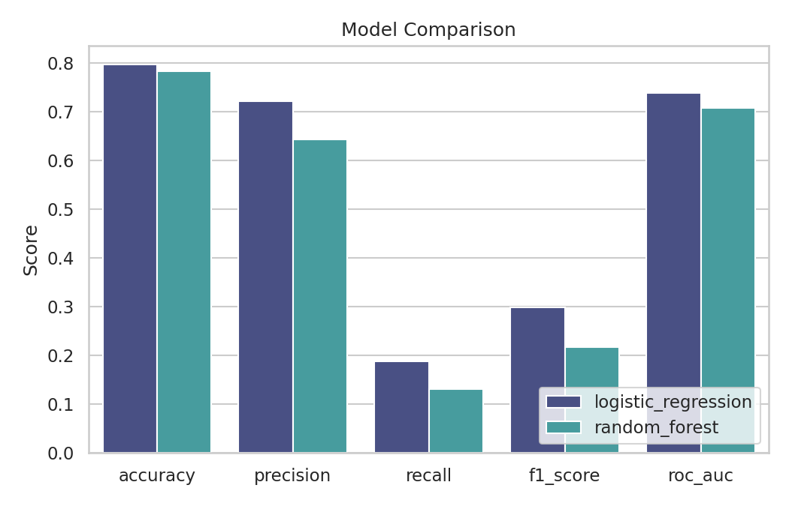
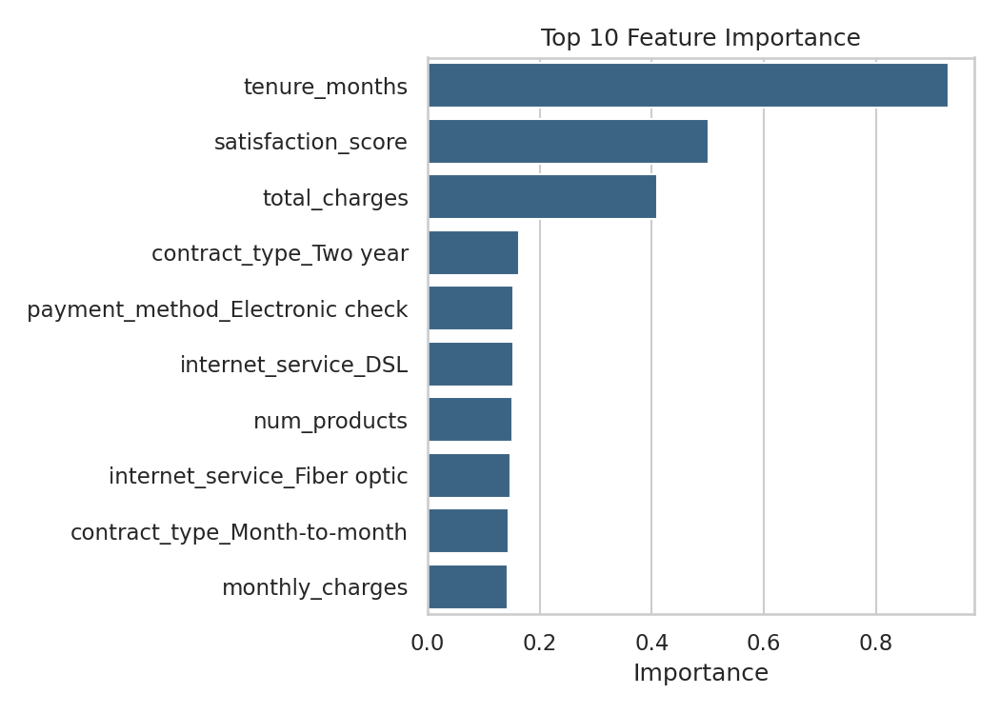
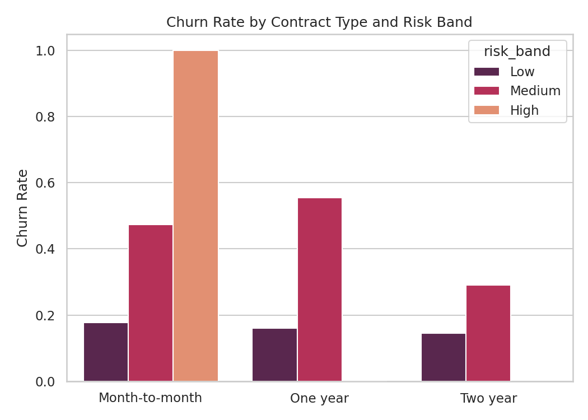
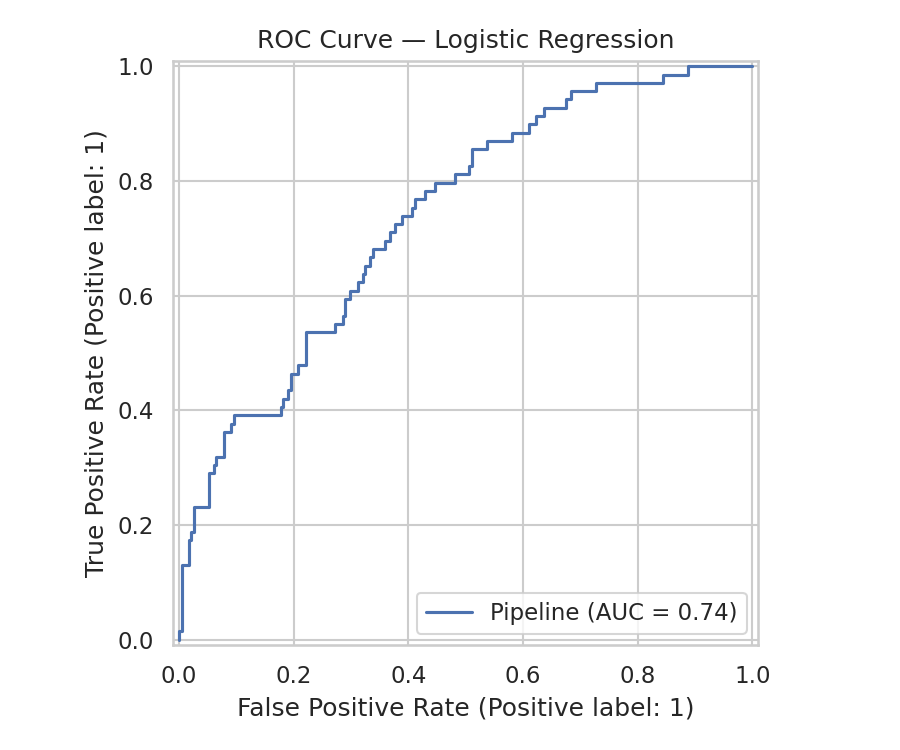
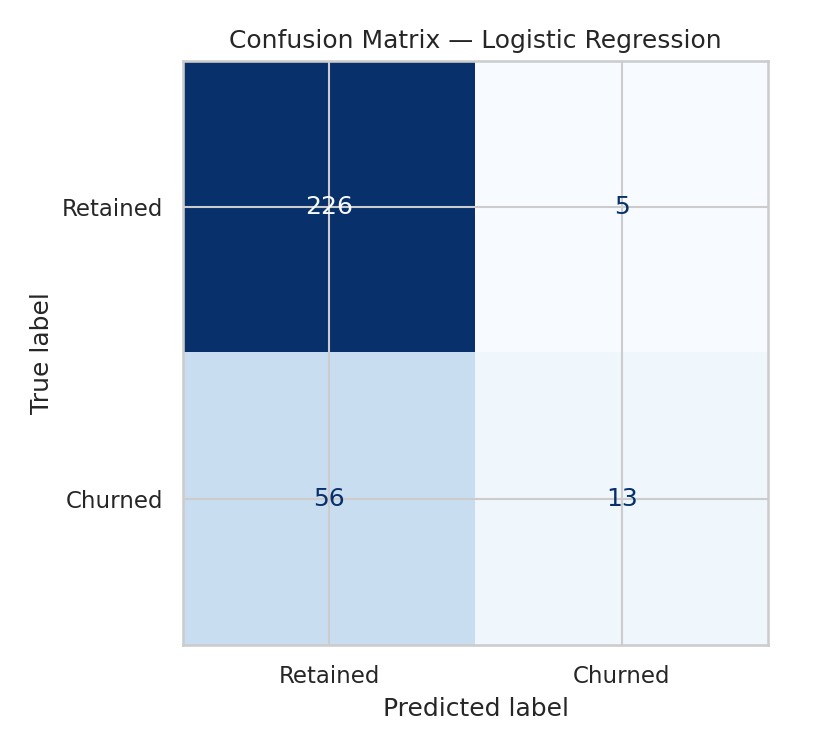

# Customer Retention Analytics


A churn-prediction workflow that scores every customer's retention risk,
identifies the strongest drivers of churn, and turns the output into
dashboard-ready views for a business audience — with a live interactive
demo on top.

> **Note:** the underlying dataset is synthetic/illustrative, built to
> exercise a realistic subscription-business schema (contract type,
> billing, usage, support tickets, satisfaction).

**[Live Streamlit demo →](#)** &nbsp;·&nbsp; **[Power BI dashboard →](#)** &nbsp;·&nbsp; **[Portfolio →](https://andrewdankyi.github.io/Portfolio/)**
*(links go live after deployment — see [Deployment](#deployment) below)*

---

## Overview

This project analyzes customer churn and builds predictive models to
identify the strongest drivers of retention. The workflow combines a
Python ML pipeline with exported, dashboard-ready CSVs — plus a
Streamlit app for live scoring and a Power BI spec for a stakeholder-facing
view.

**Business goal** — reduce churn by identifying:
- which customers are most at risk of leaving
- which product, billing, and service factors are associated with churn
- which retention actions are likely to have the highest impact

## Results at a glance

| Model | Accuracy | Precision | Recall | F1 | ROC-AUC |
|---|---|---|---|---|---|
| **Logistic Regression** (best) | 0.797 | 0.722 | 0.188 | 0.299 | **0.739** |
| Random Forest | 0.783 | 0.643 | 0.130 | 0.217 | 0.708 |

Logistic Regression wins on ROC-AUC and is used for all downstream
scoring. Recall is intentionally the weak point of both models at the
default 0.5 threshold — see [Model Performance](#model-performance)
for why, and how the risk-band thresholds below compensate for it.



## Top drivers of churn

Tenure, satisfaction score, and total charges dominate — customers who
are new, dissatisfied, and low-spend (proportionally to tenure) are the
highest-risk segment.



## Churn by segment

Month-to-month contracts carry both the most customers and the sharpest
jump in churn rate as risk band increases — the clearest lever for a
retention campaign.



## Model performance




Rather than relying on the default 0.5 classification threshold, customers
are scored with a continuous `retention_risk_probability` and bucketed into
**Low / Medium / High** risk bands (0–0.35 / 0.35–0.65 / 0.65–1.0). This
gives retention teams a ranked worklist instead of a binary yes/no call,
which matters more than raw recall for a real campaign.

## Tech stack

- **Python** — pandas, scikit-learn, matplotlib, seaborn
- **Streamlit** + **Plotly** — interactive demo app
- **Power BI** — stakeholder dashboard (spec in [`POWERBI.md`](POWERBI.md))
- **Docker** — reproducible container
- **GitHub Actions** — CI (pipeline run + Docker build on every push)

## Project structure

```
customer-retention-analytics/
├── data/
│   └── customer_retention.csv
├── notebooks/
│   └── retention_analysis.ipynb      # EDA + walkthrough
├── outputs/
│   ├── customer_retention_predictions.csv
│   ├── feature_importance.csv
│   ├── model_comparison.csv
│   ├── churn_by_segment.csv
│   ├── best_model.joblib
│   └── images/                       # charts used in this README
├── src/
│   └── retention_model.py            # training + scoring pipeline
├── app.py                            # Streamlit app
├── Dockerfile
├── .github/workflows/ci.yml
├── POWERBI.md                        # dashboard build guide
├── requirements.txt
└── README.md
```

## Methods

- Data cleaning and preprocessing (median/mode imputation, scaling, one-hot encoding)
- Stratified train/test split
- Logistic Regression baseline vs. Random Forest, compared on accuracy, precision, recall, F1, and ROC-AUC
- Feature importance extraction (model-agnostic: coefficients or impurity-based importances)
- Risk-band scoring across the full customer base
- Segment-level rollups for dashboarding

## How to run

**Local (Python):**
```bash
pip install -r requirements.txt
python src/retention_model.py   # trains models, scores customers, writes outputs/ + charts
streamlit run app.py            # launches the interactive app
```

**Docker:**
```bash
docker build -t customer-retention-analytics .
docker run -p 8501:8501 customer-retention-analytics
```
Then open `http://localhost:8501`.

## Deployment

- **Streamlit Community Cloud** — connect this repo, set `app.py` as the
  entrypoint, deploy. Free tier is sufficient; outputs are pre-committed
  so no build step is required.
- **Power BI** — follow [`POWERBI.md`](POWERBI.md) to build the dashboard
  from the exported CSVs and publish to Power BI Service.
- **CI** — every push runs the full pipeline and a Docker build via
  GitHub Actions ([`.github/workflows/ci.yml`](.github/workflows/ci.yml)).

## Portfolio value

This project demonstrates:
- predictive modeling and model comparison in Python
- translating model output into business-usable risk segments
- building both a technical (Streamlit) and executive (Power BI) view of the same analysis
- production hygiene: reproducible pipeline, containerization, CI

---

Built by [Andrew Dankyi Twum](https://andrewdankyi.github.io/Portfolio/) — Data/Financial Analyst.
